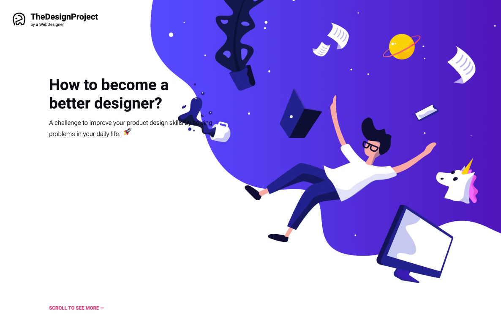

# 🌟 The Design Project

Welcome to **The Design** project, a personal challenge in my **coding journey**! 🎉  
This landing page was built with **HTML** and **CSS** to apply the fundamental skills I’ve learned during my **first 3 weeks of coding**.

## 🚀 Project Overview

**The Design** project is a **landing page** that focuses on applying the skills I’ve learned **so far**, by carefully recreating a provided template with precision.

---

---

### 🎯 Key Elements Used in the Project

In this project, I applied a variety of CSS techniques and elements that I’ve learned so far, such as:

- **Units**: mastering different types of measurements (pixels, percentages, viewport units etc...)
- **Display Flex**: for responsive layout structuring and alignment
- **Grid Layout**: creating complex designs with ease and control over placement
- **Positioning**: understanding relative, absolute, and fixed positioning for better control
- **CSS Transitions**: adding smooth effects for a more interactive user experience
- **CSS Animations**: bringing elements to life with creative movements
- **Forms**: implementing simple and user-friendly input fields

### 💡 What I Learned

This project allowed me to dive deeper into **responsive web design**, specifically learning how to:

- Align items using **flexbox** and **grid**.
- Structure complex layouts with **modern CSS**.
- Animate elements for a more dynamic page experience using **keyframes** and **hover effects**.
- Create and style input forms for **user interaction**.

## 🛠️ Tools & Technologies

- **HTML5**
- **CSS3**
- **Flexbox & Grid**
- **VS Code**

## 📸 Screenshot Preview

## 📝 Future Improvements To Come

- **Enhance responsiveness** for different device sizes.
- Implement **JavaScript** to further boost functionality.

---

Feel free to check out the project and give feedback as I continue improving my skills! 🚀  
